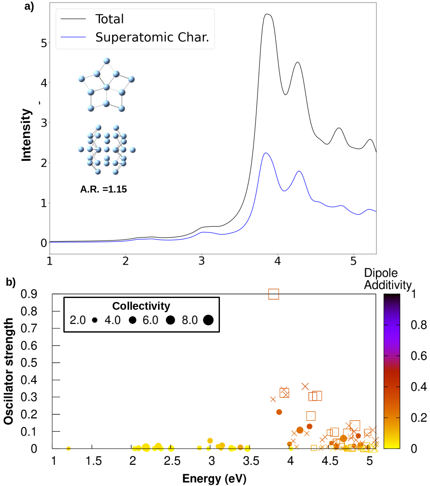

[Home](index.md) &nbsp;&nbsp; [Plasmon ID](PlasmonID.md) &nbsp;&nbsp; [Non-Adabatic Couplings from OpenMopac](NACOpenMopac.md) &nbsp; &nbsp;[Playing with OpenMD](OpenMDPlay.md)

# Plasmon ID
In the silver nanowires there have been two main absorption peaks(longitudinal and transverse peaks) of interest where some groups determined the longitudinal peak to peak to be plasmonic, others claimed only the transverse was plasmonic, and some just called both of them plasmonic.
The goal of this project is to categorize optically allowed excited states as plasmon-like or not, using [analytical methods](https://pubs.acs.org/doi/10.1021/acs.jpcc.9b10569) developed by my advisor and co-workers, that make up excited states in the longitudinal and transverse peaks.
Below in part a) is the total absorption spectra and the absorption spectra scaled by the superatomic character of each excited state that contributes to the absorption spectra. 

Part b) is the "Plasmon ID" plot this plot has  

